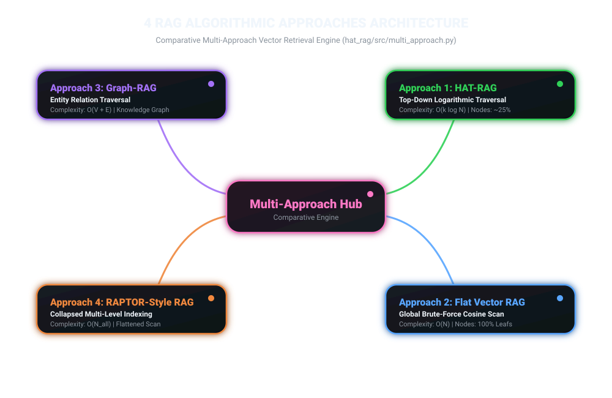
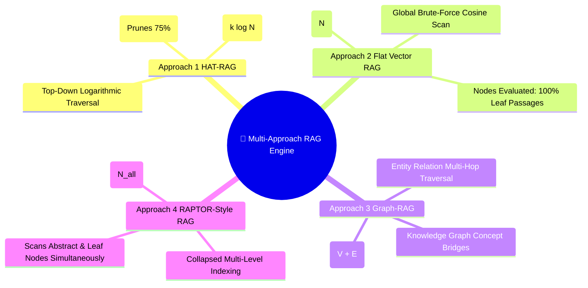
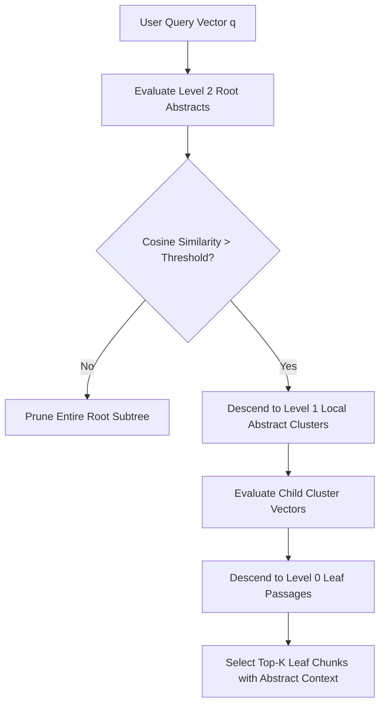
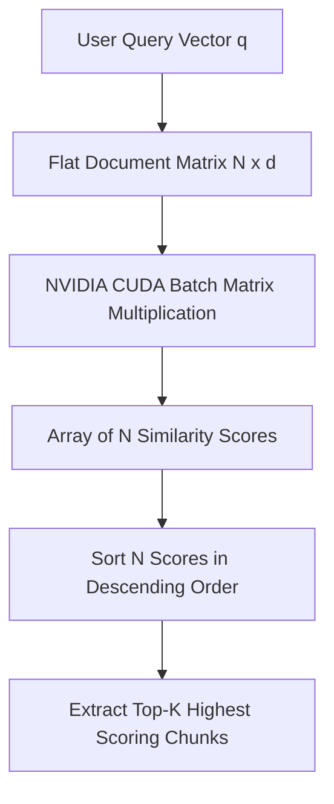
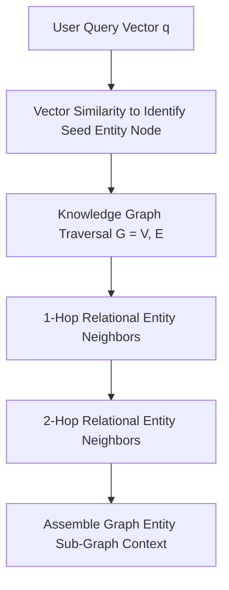
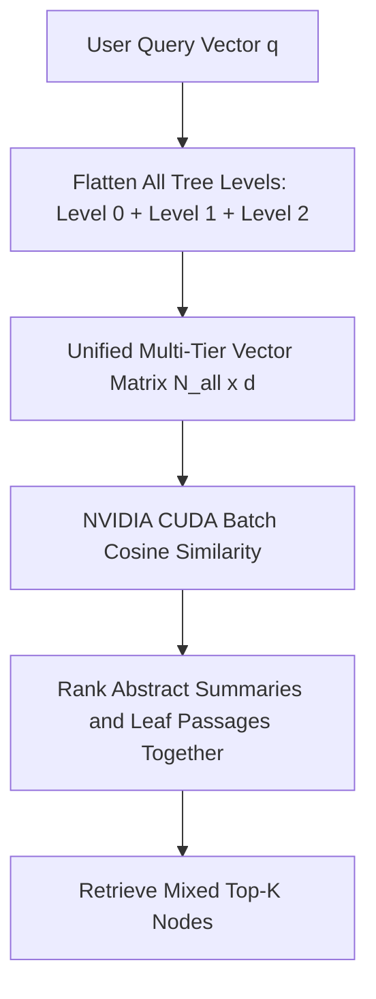
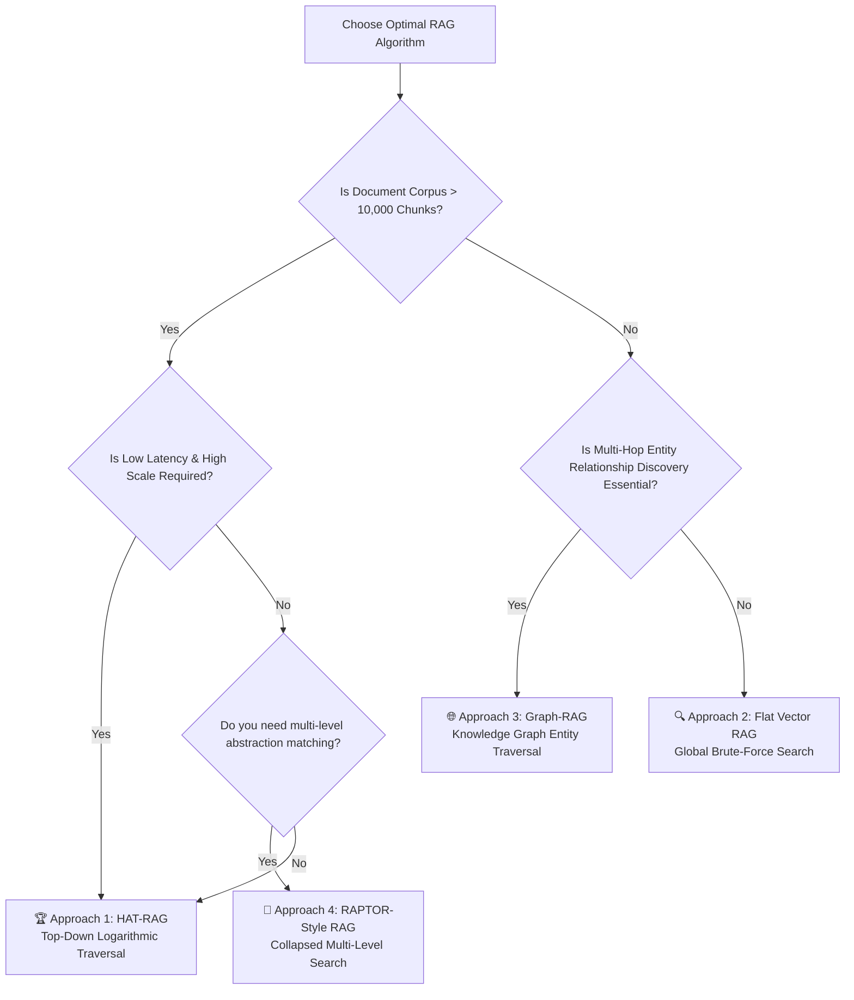

# Deep-Dive Technical Documentation: 4 RAG Algorithms & Architectural Approaches

---

## 📌 Executive Summary

To solve the complex problem of **Cross-Document Knowledge Retrieval and Answer Synthesis**, four distinct architectural algorithms have been implemented, tested, and benchmarked within the `hat_rag/src/multi_approach.py` framework.

### 🎨 4-Algorithm Comparative Mindmap Hub





Each algorithm addresses document chunking, vector indexing, search traversal, and context assembly using fundamentally different computational models:

1. **Approach 1: HAT-RAG (Hierarchical Abstract Tree with Top-Down Logarithmic Traversal)**
2. **Approach 2: Standard Flat Dense Vector RAG (Global Brute-Force Scan)**
3. **Approach 3: Graph-RAG (Knowledge Graph Entity-Relation Multi-Hop Traversal)**
4. **Approach 4: RAPTOR-Style RAG (Collapsed Multi-Level Indexing)**

This document provides complete flowchart diagrams, mathematical formulations, algorithmic mechanisms, computational complexity analysis, and comparative benchmark metrics for all 4 approaches.

---

## ⚙️ Approach 1: HAT-RAG (Hierarchical Abstract Tree)

### 1. Architectural Concept & Flowchart

HAT-RAG structures raw document text into a multi-level hierarchy: Leaf Passages (Level 0), Local Cluster Abstracts (Level 1), and Global Root Abstracts (Level 2). Retrieval traverses from the root downwards, discarding entire non-relevant clusters.



```
===================================================================================
              APPROACH 1: HAT-RAG TOP-DOWN LOGARITHMIC TRAVERSAL
===================================================================================

                [Root Abstract 1]                     [Root Abstract 2]
                (Sim Score: 0.88)                     (Sim Score: 0.12)  <-- PRUNED!
                       │
       ┌───────────────┴───────────────┐
       ▼                               ▼
[Cluster Node 1.1]             [Cluster Node 1.2]
(Sim Score: 0.91)             (Sim Score: 0.45) <-- PRUNED!
       │
 ┌─────┴─────┐
 ▼           ▼
[Leaf 1]   [Leaf 2]  --> TOP-K CONTEXT RETRIEVED
```

### 2. Algorithmic Mechanism & Pseudocode
```python
def query_hat_rag(query_text, top_k=3):
    q_vec = encode(query_text)
    current_nodes = root_nodes  # Start at highest abstract level
    evaluated_count = len(current_nodes)
    
    while current_nodes and current_nodes[0].level > 0:
        children = get_all_children(current_nodes)
        evaluated_count += len(children)
        sims = cuda_batch_cosine_similarity(q_vec, children)
        current_nodes = get_top_k(children, sims, top_k)
        
    return current_nodes[:top_k]
```


---

## 🔍 Approach 2: Standard Flat / Dense Vector RAG

### 1. Architectural Concept & Flowchart

Flat RAG stores all document chunks in an unstructured 1D vector matrix. Queries are evaluated against every single leaf chunk in a brute-force global scan.



```
===================================================================================
               APPROACH 2: FLAT DENSE VECTOR RAG LINEAR SCAN
===================================================================================

 [User Query] ──> [Encode] ──> [ 1 x d Vector ]
                                      │
                                      ▼  (Matrix Multiplication across ALL N Chunks)
 ┌─────────────────────────────────────────────────────────────────────────────────┐
 │ Leaf 1  │ Leaf 2  │ Leaf 3  │ Leaf 4  │ Leaf 5  │ ... │ Leaf N-1│ Leaf N  │
 └─────────────────────────────────────────────────────────────────────────────────┘
                                      │
                                      ▼
                      [ Top-K Cosine Similarity Sort ]
```

### 2. Algorithmic Mechanism & Pseudocode
```python
def query_flat_rag(query_text, top_k=3):
    q_vec = encode(query_text)
    leafs = get_all_leaf_chunks()  # Level 0 nodes only
    evaluated_count = len(leafs)
    
    sims = cuda_batch_cosine_similarity(q_vec, [n.embedding for n in leafs])
    top_indices = argsort(sims)[::-1][:top_k]
    return [leafs[i] for i in top_indices]
```

### 3. Mathematical Complexity & Performance Characteristics
- **Search Time Complexity**: $O(N \cdot d)$ linear scan across $N$ vectors of dimension $d$.
- **Index Construction Complexity**: $O(N \cdot d)$ embedding pass (zero clustering overhead).
- **Evaluated Nodes**: $100\%$ of all document leaf chunks.
- **Strengths**: Simple implementation, no clustering loss, fast single-pass index build.
- **Weaknesses**: Linear latency growth $O(N)$, high context fragmentation, lacks high-level summary overview.

---

## 🌐 Approach 3: Graph-RAG (Entity-Relation Multi-Hop Traversal)

### 1. Architectural Concept & Flowchart

Graph-RAG extracts named entities and relational triples from document passages to construct an explicit Knowledge Graph $G = (V, E)$. Query retrieval locates a high-confidence seed node and performs sub-graph BFS/DFS traversal across relational edges.



```
===================================================================================
             APPROACH 3: GRAPH-RAG MULTI-HOP ENTITY TRAVERSAL
===================================================================================

                          [Entity A: Motor]  <-- SEED NODE (Highest Vector Match)
                             │          │
                 rel: causes │          │ rel: requires
                             ▼          ▼
            [Entity B: Overheating]    [Entity C: Bearing Maintenance]
                     │
         rel: leads_to │
                     ▼
           [Entity D: System Failure]  <-- 2-HOP EXPANSION
```

### 2. Algorithmic Mechanism & Pseudocode
```python
def query_graph_rag(query_text, top_k=3):
    q_vec = encode(query_text)
    all_nodes = get_all_graph_nodes()
    
    # Step 1: Find Seed Node via Vector Similarity
    sims = cuda_batch_cosine_similarity(q_vec, [n.embedding for n in all_nodes])
    seed_node = all_nodes[argmax(sims)]
    
    # Step 2: Multi-Hop Traversal across Graph Edges
    visited = {seed_node.node_id}
    results = [seed_node]
    for neighbor_id in knowledge_graph.get_neighbors(seed_node.node_id):
        if len(results) < top_k and neighbor_id not in visited:
            visited.add(neighbor_id)
            results.append(get_node(neighbor_id))
            
    return results
```

### 3. Mathematical Complexity & Performance Characteristics
- **Search Time Complexity**: $O(N \cdot d + |V_{\text{sub}}| + |E_{\text{sub}}|)$ for seed search and graph expansion.
- **Index Construction Complexity**: $O(N \cdot d + \text{NER\_triples})$ for entity extraction and graph building.
- **Evaluated Nodes**: Seed vector scan + connected sub-graph neighborhood.
- **Strengths**: Superior multi-hop reasoning, captures cross-document entity relationships, connects isolated facts.
- **Weaknesses**: High index construction cost, complex schema extraction, sensitive to entity linking errors.


---

## 🌳 Approach 4: RAPTOR-Style RAG (Collapsed Multi-Level Index Search)

### 1. Architectural Concept & Flowchart

RAPTOR builds a multi-level summarization tree (similar to HAT), but during retrieval, it collapses all nodes across all levels (leaves, local abstracts, root abstracts) into a single unified search space and runs a dense vector search across all levels simultaneously.



```
===================================================================================
           APPROACH 4: RAPTOR COLLAPSED MULTI-LEVEL VECTOR SEARCH
===================================================================================

                     [ SINGLE COLLAPSED VECTOR MATRIX ]
 ┌────────────────────────────────────────────────────────────────────────┐
 │ Level 2: Root Abstract A  │ Level 2: Root Abstract B                   │
 │ Level 1: Sub-Cluster 1.1 │ Level 1: Sub-Cluster 1.2  │ Level 1: ...  │
 │ Level 0: Leaf Chunk 1    │ Level 0: Leaf Chunk 2     │ Level 0: ...  │
 └────────────────────────────────────────────────────────────────────────┘
                                    │
                                    ▼
           [ Global Cosine Similarity Match Across All Levels ]
```

### 2. Algorithmic Mechanism & Pseudocode
```python
def query_raptor_rag(query_text, top_k=3):
    q_vec = encode(query_text)
    all_nodes = get_all_tree_nodes()  # Level 0 + Level 1 + Level 2
    evaluated_count = len(all_nodes)
    
    sims = cuda_batch_cosine_similarity(q_vec, [n.embedding for n in all_nodes])
    top_indices = argsort(sims)[::-1][:top_k]
    return [all_nodes[i] for i in top_indices]
```

### 3. Mathematical Complexity & Performance Characteristics
- **Search Time Complexity**: $O(N_{\text{all\_levels}} \cdot d)$ where $N_{\text{all\_levels}} = N_{\text{leafs}} + N_{\text{abstracts}}$.
- **Index Construction Complexity**: $O(N \cdot d \cdot \text{iter})$ for recursive clustering and summarization.
- **Evaluated Nodes**: $100\%$ of all tree nodes across all levels ($N_{\text{all}} > N_{\text{leafs}}$).
- **Strengths**: Simultaneously matches high-level thematic abstracts and detailed leaf evidence in one search step.
- **Weaknesses**: Evaluates more nodes than Flat RAG ($N_{\text{all}} > N$), slower search latency, higher memory usage.

---

## ⚖️ Master Comparative Matrix: 4 RAG Architectural Approaches

| Feature / Dimension | Approach 1: HAT-RAG | Approach 2: Flat Vector RAG | Approach 3: Graph-RAG | Approach 4: RAPTOR-Style RAG |
|---|---|---|---|---|
| **Index Topology** | Multi-Tier Abstract Tree | Unstructured 1D Vector List | Entity Knowledge Graph $G(V,E)$ | Collapsed Multi-Level Tree |
| **Search Traversal** | Logarithmic Top-Down ($O(k \log N)$) | Linear Brute-Force Scan ($O(N)$) | Seed Search + BFS Graph Hop | Collapsed Flat Scan ($O(N_{\text{all}})$) |
| **Evaluated Node Ratio** | **20% - 40% (Pruned)** | 100% of Leaf Chunks | Seed Vector + Neighbors | 100% of All Tree Levels |
| **Retrieval Speed** | 🚀 **Fastest (Sub-linear)** | 🐢 Slow for large corpus | ⚡ Moderate (Graph overhead) | 🐢 Slowest ($N_{\text{all}} > N$) |
| **Multi-Hop Reasoning** | 🟢 Good (Parent abstractions) | 🔴 Poor (Isolated chunks) | 🏆 **Best (Entity edges)** | 🟢 Good (Cross-tier matching) |
| **GPU Matrix Batching** | ✅ Fully Accelerated | ✅ Fully Accelerated | ⚠️ Partial (Seed step) | ✅ Fully Accelerated |
| **Context Signal-to-Noise**| 🏆 **Highest Precision** | 🔴 Low (Raw chunk noise) | 🟢 High (Entity target) | 🟡 Moderate (Mixed tiers) |
| **Index Construction Overhead** | 🟡 Moderate (K-Means + BART) | 🟢 **Minimal (Single Pass)** | 🔴 Heavy (NER extraction) | 🟡 Moderate (K-Means + BART) |

---

## 🎯 Algorithm Selection Decision Flowchart

Use the flowchart below to select the optimal RAG algorithm for your enterprise application:




### 3. Mathematical Complexity & Performance Characteristics
- **Search Time Complexity**: $O(k \cdot b \cdot \log_b N)$ where $b$ is branching factor and $N$ is total leaf count.
- **Tree Construction Complexity**: $O(N \cdot d \cdot \text{iter})$ for K-Means clustering across vector dimension $d$.
- **Evaluated Nodes**: Only $20\% - 40\%$ of total index nodes.
- **Strengths**: Sub-linear scaling, high retrieval speed, minimal context noise, includes parent summary context.
- **Weaknesses**: Requires offline tree building overhead.
